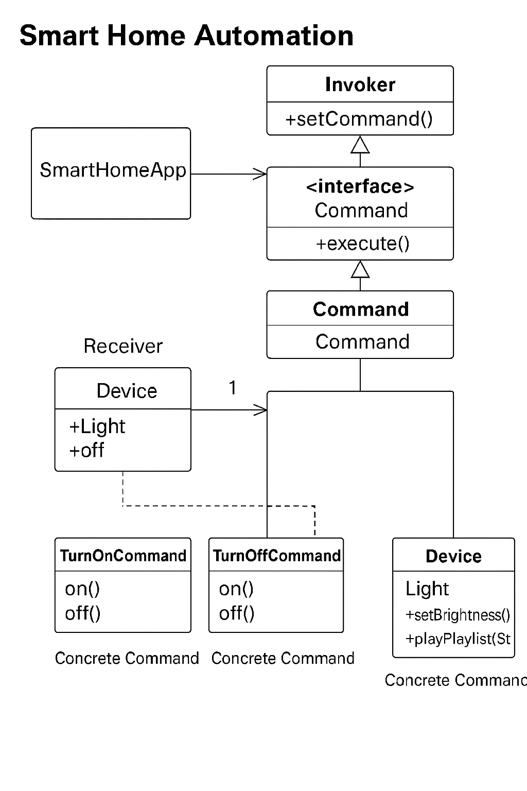
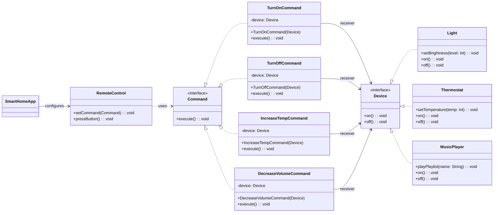

# Smart Home Automation

Imagine you're building a smart home automation system where various devices (lights, thermostat, music player, etc.) can be controlled remotely using a central hub or app. Each device has different functionalities, but you want to create a unified and flexible control mechanism.

## Design Requirements

Design a system that allows you to control multiple smart home devices with ease. Your goal is to create a solution where:

- You can control a variety of devices from a central hub or app, sending commands like "Turn On," "Turn Off," "Increase Temperature," "Decrease Volume," etc.
- Each device has unique actions associated with these commands. For example, turning on the lights might involve changing their brightness level, while turning on the music player may involve playing a specific playlist.
- New devices can be seamlessly integrated into the system without modifying existing code. You want to ensure that adding a new device doesn't require changes to the central control logic.
- Devices can be controlled without the central hub or app needing to understand the internal workings of each device. It should send high-level commands without needing low-level details.

## Challenge

Your challenge is to apply a design pattern that provides a flexible and scalable way to control a variety of smart home devices, ensuring that new devices can be added without disrupting the existing system's functionality.

## Class Diagram

## Project Structure

The `src/` folder contains the Java source files implementing the Command pattern for the smart home automation system:

- `Command.java`: Interface defining the `execute()` method for commands.
- `Device.java`: Interface for devices with `on()` and `off()` methods.
- `Light.java`: Concrete device class for lights, implements `Device` with brightness control.
- `MusicPlayer.java`: Concrete device class for music players, implements `Device` with playlist and volume functionality.
- `RemoteControl.java`: Invoker class that holds and executes commands.
- `SmartHomeTest.java`: Main class demonstrating the system with test scenarios.
- `Thermostat.java`: Concrete device class for thermostats, implements `Device` with temperature control.
- `TurnOffCommand.java`: Concrete command class for turning devices off.
- `TurnOnCommand.java`: Concrete command class for turning devices on.
- `IncreaseTempCommand.java`: Concrete command class for increasing thermostat temperature.
- `DecreaseVolumeCommand.java`: Concrete command class for decreasing music player volume.

